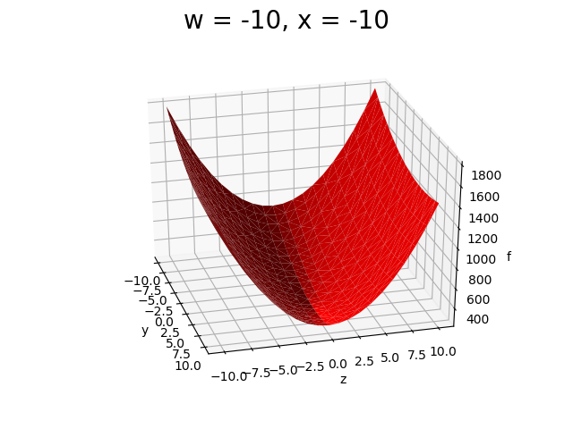

<h1 align='center'>Positive Definite Equation Plot</h1>

A certain question in the second edition of our Annual Mathematics - **1729** required the participants to check if a [quadratic form](https://en.wikipedia.org/wiki/Quadratic_form) with integer matrix is universal i.e., it takes in all positive integers as values.

This can be proved using the [15 and 290 theorems](https://en.wikipedia.org/wiki/15_and_290_theorems).

The 15 Theorem states:

```If a positive definite quadratic form with integer matrix represents all positive integers up to 15, then it represents all positive integers.```

While the 290 Theorem says:

```A positive definite integral quadratic form is universal if it takes the numbers from 1 to 290 as values.```

So, the quadratic form should satisfy two conditions before we can apply the 15 Theorem to prove its universality:
1. It shoud be a **positive definite** quadratic form.
2. It should have an integer matrix.

The second condition can easily be checked by looking at the matrix. Proving if the quadratic form was indeed **positive definite** was making me scratch my head at the beginning. Though later, I found out that it can be done by applying the [second derivative test](https://en.wikipedia.org/wiki/Derivative_test).

[Here](http://faculty.csuci.edu/brian.sittinger/2nd_DerivTest.pdf) is a paper explaining how to apply the second derivative test for equations in n variables.

I applied the test for a particular quadratic form
**w<sup>2</sup> + 2x<sup>2</sup> + 2y<sup>2</sup> + 11z<sup>2</sup> + 2wy + 4wz - 4xz**
and it came out to be positive definite with the minima at `(0, 0, 0, 0)`.

Now this was so exciting that I wanted to see geometrically how a positive definite quadratic form in four variable looks like.
Geometrically, if a quadratic form is positive definite, then it is guarenteed to have a minima so, the function should always look like some curve pointing up from the minima.

To visualise the quadratic, I decided to generate points for the variables `w`, `x`, `y`, `z` and the function `f(w, x, y, z)` and plot them using matplotlib in python.

This was a little tough because till now, I have only plotted equations in two variables with the variables on the x and y axis and the function `f(x,y)` on the z axis.

I made [generate_points.py](generate_points.py) to create the points and made separate folders for each value of `w` and in each folder, separate csv files for each value of `x`. Each file contains lines that had values of the variables and the function. The reason to do this will be a little more clear later.

Initially, I kept `w` and `x` constant and plotted `f(w, x, y, z)` by taking integer points for `y`, `z` from [-10,10]. The graph ss a simple quaratic plot as shown below.



Now, plotting `x` on the same graph was again a tough work. Initially, I thought about creating different plots as above for different values of `x` and then combining them together so that can give a sense of changing `x` with 'time' so the three variables can be expresed by representing two on the axes with `f(w, x, y, z)` on the third axis and the third variable as the time (This was a realy cool realization for me). But this left out `w` with no other way to represent it.

I stumbled upon these sites:
- https://medium.com/@prasadostwal/multi-dimension-plots-in-python-from-2d-to-6d-9a2bf7b8cc74
- http://new.math.uiuc.edu/math198/MA198-2009/serio2/
- http://www.rdrop.com/users/half/Creations/Puzzles/visualizing.4D/index.html

that helped me choose 'colour' as a way to represent the next dimension. Therefore, I chose 21 colours from the 'rainbow' colormap to represnt the different values of x from -10 to 10. The plot for changing `x`, `y` and `z` is as shown below.


Representing `w` was not a big task then. Just creating 21 different plots (for each value from -10 to 10) with changing `x`, `y`, `z` and then combining them together as a gif to give an element of 'time' to the variable `w` and we can represent the function in four variables in a plot as below.

I used [plot.py](plot.py) to make the different plots for different values of `w` and then combine them as a gif using [create_gif.py](create_gif.py)


This plot clearly shows that the quadratic form is positive definite and for any value of `(w, x, y, z) > 0`, the curve is always upwards from the minima.
